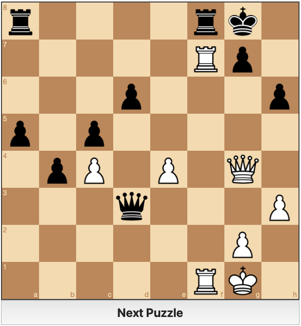

# Generate_Chess_Puzzles 

<br/>
This repository generates checkmate chess puzzles from games played on chess.com by a specified user (preferably you) via a python script. The generated checkmate puzzles are stored in a local json file. After that one can run a webpack dev server that utilizes chessboard.js and chess.js to make the generated and stored chesspuzzles solvable in the local browser. 

<br/>

## Requirements
- [Python3](https://www.python.org/downloads/release/python-3913/) [Version >= 3.9.5]
- [Stockfish](https://stockfishchess.org/download/)
- [Node.js](https://nodejs.org/en/) $\;$[Version >= v16.2.0]
- [Yarn](https://yarnpkg.com/en/docs/install#mac-stable) $\hspace{0.51cm}$[Version >= 1.22.10]

## Getting Started
Installation steps to set this repository up and running the application.

## Setup 
#### Clone repo (and specify folder name)
```shell
git clone https://github.com/4B1N1TIO/Generate_Chess_Puzzles.git PROJECT_NAME
```

## Install 

#### Navigate in folder
```shell
cd PROJECT_NAME
```

#### Install Python dependecies
Windows
```shell
python -m pip install -r requirements.txt
```
Linux / MacOS
```shell
python3 -m pip install -r requirements.txt
```
#### Install NPM dependencies
```shell
yarn
```

## Available scripts
### Generate Chess puzzles
```shell
python puzzle_generation.py -u CHESSDOTCOM_USERNAME -p PATH_TO_STOCKFISH [-n NUMBER_OF_GAMES_USED]

```
#### A json file with generated checkmate puzzles extracted from the supplied user's games is created in src/assets/puzzles.json. This may take a while, because all the user's games have to be downloaded and NUMBER_OF_GAMES_USED games have to be evaluated by stockfish.
<br/>


### Start development server
```shell
yarn serve
```


On desktop visit http://localhost:8080 to open the project. An example puzzle in the running browser is shown as follows:



## Feedback and Contribution
If you find a bug or if you have a feature request , please file an issue.

Contribution is always welcome. Let me know that you want to contribute and please raise an issue before making a PR, so that the issue and implementation can be discussed before you write any code. 

Good luck solving your on the fly created checkmate puzzles!


